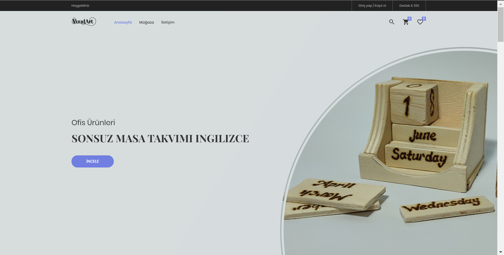
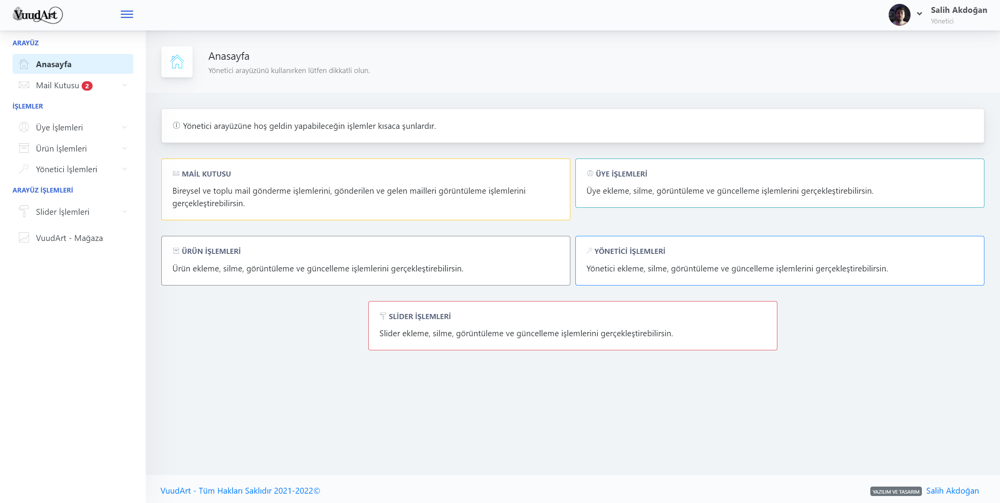
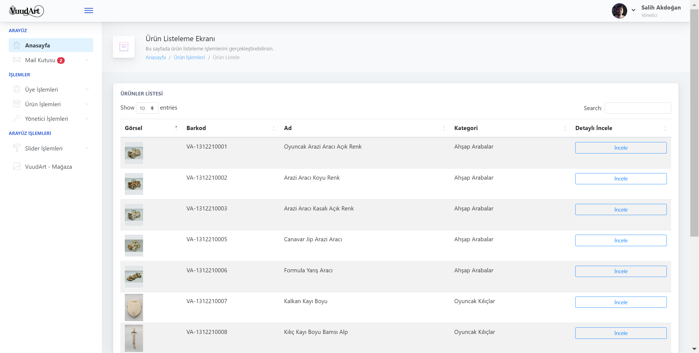

### Proje hakkında (TR):
Bir e-ticaret website projesidir.
Admin ve müşteri olmak üzere iki paneli bulunur.
>*Herhangi bir şekilde ticari amaçla kullanılamaz.
Herhangi bir firma ile ilişiği yoktur.*

İlk projelerimden olduğu için mantık hataları ve spagetti kodlar bulunabilir.

Aşağıda sıralı olan teknolojileri öğrenmek için oluşturulmuş bir projedir.

##### Kullanılan teknolojiler:
- C# programlama dili
- ASP.Net framework
- HTML ile site iskeleti yapısı
- CSS ile genel site tasarımı
- Bootstrap ui materyelleri 
- Hazır HTML şablonları üzerinde düzenlemeler
- JavaScript betik dili
- MSSQL veritabanı ilişkisi
- Veritabanı CRUD işlemleri

>- Veritabani dosyalarına proje içerisindeki
<a href="https://github.com/salihakdogan/vuudart_website/blob/master/VuudArt.sql">VuudArt.sql</a> dosyasından ulaşabilirsiniz.
>- Proje tam olarak bitirilmedi. Yeni teknolojiler ile geliştirilmeye devam edilecektir.
>- [En alt kısımdan proje hakkında görsellere ulaşabilirsiniz.](#images)
---

### About project (EN):
It is an e-commerce website project.
It has two panels, admin and client.
>*It cannot be used for commercial purposes in any way.
It is not affiliated with any company.*

Since it is one of my first projects, logic errors and spaghetti codes can be found.

It is a project created to learn the technologies listed below.

##### Used technologies:
- C# programming language
- ASP.Net framework
- Site skeleton structure with HTML
- General site design with CSS
- Bootstrap ui materials
- Edits on HTML templates
- JavaScript scripting language
- MSSQL database relationship
- Database CRUD operations

>- Database files in the project
You can access it from the <a href="https://github.com/salihakdogan/vuudart_website/blob/master/VuudArt.sql">VuudArt.sql</a> file.
>- The project is not completely finished. It will continue to be developed with new technologies.
>- [You can find images about the project at the bottom.](#images)
---
<h3 id="images">Proje hakkında görseller / Images about the projects</h5>

Müşteri arayüzü / Customer interface

Admin arayüzü / Admin interface

Admin arayüzü / Admin interface

